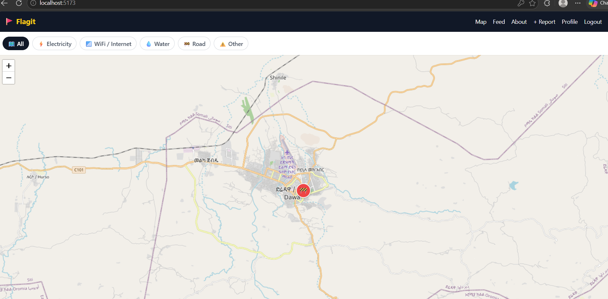
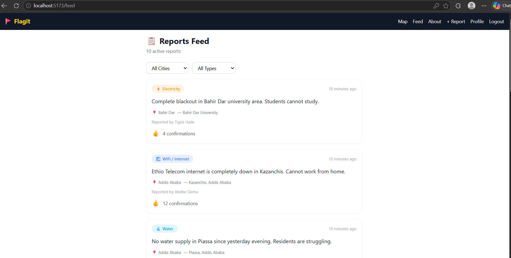
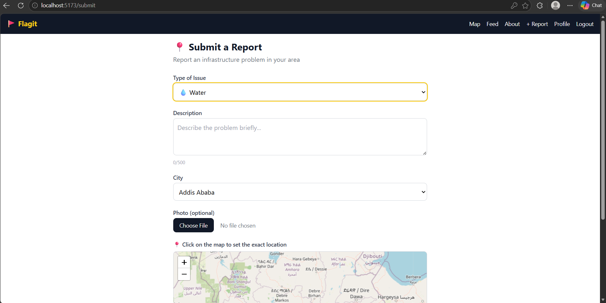
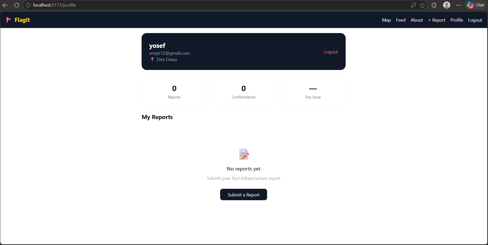

# 🇪🇹 Flagit Community Infrastructure Reporter

> A platform where Ethiopians can report and track local infrastructure problems in real time like, electricity outages, WiFi/internet failures, water shortages, road damage, and more. Built on a live map so communities stay informed.

🔗 Live Demo: [Flagit-production.vercel.app](https://flagit-beta.vercel.app/)
🖥️ Backend API: [Flagit-api.up.railway.app](https://Flagit-api.up.railway.app)  
👤 Built by: [Nathnael](https://github.com/ND1603) — Internship Project 2026

---

## 📌 The Problem

In Ethiopia, when electricity goes out, WiFi drops, a water pipe bursts, or a road cracks people find out by posting in crowded Telegram groups or calling neighbors. There is no central place to see what is happening, where it is happening, or how widespread a problem is.

**Flagit** solves this by giving every Ethiopian a simple way to pin a problem on a map, so their whole community can see it, confirm it, and track when it is resolved.

---

## ✨ Features

| Feature | Description |
|---|---|
| 🗺️ **Live Map** | All active reports shown as color-coded pins by category |
| 📝 **Submit Report** | Pick a location on the map, choose a type, add description + optional photo |
| 👍 **Upvote / Confirm** | Community members confirm reports are still active |
| 🔍 **Filter by Category** | Filter map and feed by electricity, WiFi, water, road, or other |
| 🌆 **Filter by City** | View reports in Addis Ababa, Hawassa, Dire Dawa, and more |
| ⏱️ **Auto-Expire** | Reports expire after 24 hours unless confirmed — keeps the map current |
| 👤 **User Profiles** | View and manage your own submitted reports |
| 📸 **Photo Upload** | Attach photos to give context to your report |
| 🔐 **Authentication** | Secure register and login with JWT tokens |

---

## 🛠️ Tech Stack

### Frontend
| Tool | Purpose |
|---|---|
| React (Vite) | UI framework |
| React Router | Client-side routing |
| Leaflet.js + React-Leaflet | Interactive map with OpenStreetMap tiles |
| Axios | HTTP client for API requests |
| Tailwind CSS | Styling |
| react-hot-toast | Toast notifications |

### Backend
| Tool | Purpose |
|---|---|
| Node.js + Express | Web server and REST API |
| MongoDB + Mongoose | Database and data modeling |
| bcryptjs | Password hashing |
| JSON Web Tokens (JWT) | Authentication |
| Multer | Photo file uploads |
| Helmet | Security headers |
| express-rate-limit | Rate limiting |
| express-validator | Input validation |

### Deployment
| Service | What it hosts |
|---|---|
| Vercel | React frontend |
| Railway | Node.js backend |
| MongoDB Atlas | Cloud database |

---

## 🗂️ Project Structure

```
habroch-reporter/
├── client/                        # React frontend
│   ├── src/
│   │   ├── api/
│   │   │   └── index.js           # Axios instance with auth interceptor
│   │   ├── components/
│   │   │   ├── Navbar.jsx
│   │   │   └── ReportCard.jsx
│   │   ├── context/
│   │   │   └── AuthContext.jsx    # Global auth state
│   │   └── pages/
│   │       ├── MapPage.jsx        # Main map with live pins
│   │       ├── FeedPage.jsx       # List view of reports
│   │       ├── SubmitPage.jsx     # Submit a new report
│   │       ├── LoginPage.jsx
│   │       ├── RegisterPage.jsx
│   │       └── ProfilePage.jsx    # User's own reports
│   └── .env                       # VITE_API_URL
│
└── server/                        # Node.js backend
    ├── middleware/
    │   └── auth.js                # JWT verification middleware
    ├── models/
    │   ├── User.js
    │   └── Report.js
    ├── routes/
    │   ├── auth.js                # /api/auth/register, /api/auth/login
    │   └── reports.js             # /api/reports CRUD
    ├── uploads/                   # User-uploaded photos
    ├── seed.js                    # Sample data script
    └── index.js                   # Entry point
```

---

## 🚀 Getting Started (Run Locally)

### Prerequisites
Make sure you have these installed:
- [Node.js v18+](https://nodejs.org)
- [Git](https://git-scm.com)
- A free [MongoDB Atlas](https://mongodb.com/cloud/atlas) account

### 1. Clone the repository

```bash
git clone https://github.com/ND1603/Flagit-reporter.git
cd Flagit-reporter
```

### 2. Set up the backend

```bash
cd server
npm install
```

Create a `.env` file inside the `server` folder:

```env
PORT=5000
MONGO_URI=your_mongodb_atlas_connection_string
JWT_SECRET=your_secret_key_here
CLIENT_URL=http://localhost:5173
```

Start the server:

```bash
npm run dev
# Server running on port 5000 ✅
# MongoDB connected ✅
```

### 3. Set up the frontend

Open a new terminal:

```bash
cd client
npm install
```

Create a `.env` file inside the `client` folder:

```env
VITE_API_URL=http://localhost:5000
```

Start the frontend:

```bash
npm run dev
# App running at http://localhost:5173 ✅
```

### 4. (Optional) Seed the database with sample data

```bash
cd server
node seed.js
```

This adds 15 sample reports across Addis Ababa, Hawassa, and Dire Dawa.

---

## 📡 API Documentation

### Base URL
```
Local:      http://localhost:5000/api
Production: https://habroch-api.up.railway.app/api
```
POST   /api/auth/register    → Register a new user
POST   /api/auth/login       → Login and get token
GET    /api/reports          → Get all active reports
POST   /api/reports          → Submit a report (auth required)
PUT    /api/reports/:id/upvote → Upvote a report (auth required)
GET    /api/reports/my-reports → Get your own reports (auth required)
DELETE /api/reports/:id      → Delete your report (auth required)

### Authentication Endpoints

#### `POST /auth/register`
Create a new user account.

**Request body:**
```json
{
  "name": "Abebe Girma",
  "email": "abebe@example.com",
  "password": "securepassword",
  "city": "Addis Ababa"
}
```

**Response:**
```json
{
  "token": "eyJhbGciOiJIUzI1NiIsInR5cCI...",
  "user": {
    "id": "64f3a...",
    "name": "Abebe Girma",
    "email": "abebe@example.com",
    "city": "Addis Ababa"
  }
}
```

---

#### `POST /auth/login`
Log in with existing credentials.

**Request body:**
```json
{
  "email": "abebe@example.com",
  "password": "securepassword"
}
```

**Response:** Same as register — returns token and user object.

---

### Report Endpoints

#### `GET /reports`
Fetch all active, non-expired reports.

**Query parameters (optional):**
| Parameter | Type | Example |
|---|---|---|
| `type` | string | `?type=electricity` |
| `city` | string | `?city=Addis%20Ababa` |

**Response:** Array of report objects with submitter name populated.

---

#### `POST /reports` 🔒 *Auth required*
Submit a new report. Accepts `multipart/form-data` for photo uploads.

**Form fields:**
| Field | Type | Required |
|---|---|---|
| `type` | electricity \| wifi \| water \| road \| other | ✅ |
| `description` | string (max 500 chars) | ✅ |
| `lat` | number | ✅ |
| `lng` | number | ✅ |
| `city` | string | ✅ |
| `address` | string | ❌ |
| `photo` | image file | ❌ |

---

#### `PUT /reports/:id/upvote` 🔒 *Auth required*
Toggle an upvote on a report. Calling it twice removes the upvote.

---

#### `GET /reports/my-reports` 🔒 *Auth required*
Get all reports submitted by the currently logged-in user.

---

#### `DELETE /reports/:id` 🔒 *Auth required*
Delete a report. Only the original submitter can delete their own report.

---

### Status Codes

| Code | Meaning |
|---|---|
| `200` | Request succeeded |
| `201` | Resource created |
| `400` | Invalid input data |
| `401` | Missing or invalid token |
| `403` | Forbidden — you cannot do this action |
| `404` | Resource not found |
| `500` | Server error |

---

## 🗺️ Report Categories

| Category | Map Color | Description |
|---|---|---|
| ⚡ Electricity | Yellow `#F59E0B` | Power outages and electrical failures |
| 📶 WiFi / Internet | Blue `#3B82F6` | Internet service disruptions |
| 💧 Water | Cyan `#06B6D4` | Water supply outages or pipe bursts |
| 🚧 Road | Red `#EF4444` | Potholes, damaged roads, blocked routes |
| ⚠️ Other | Purple `#8B5CF6` | Any other public infrastructure issue |

---

## 🌍 Supported Cities

- Addis Ababa
- Hawassa
- Dire Dawa
- Mekelle
- Bahir Dar
- Adama
- Jimma

---

## 🔒 Security Features

- Passwords hashed with **bcryptjs** (salt rounds: 10)
- Auth tokens use **JWT** with 7-day expiry
- **Helmet** sets secure HTTP headers
- **mongo-sanitize** prevents NoSQL injection attacks
- **express-rate-limit** limits to 100 requests per 15 minutes per IP
- **Multer** file filter restricts uploads to image types only (max 5MB)
- **CORS** restricted to the frontend domain in production

---

## 📸 Screenshots

### 🗺️ Map Page


### 📋 Feed Page


### 📝 Submit Report


### 👤 Profile Page


---

## 🗓️ Development Timeline

This project was built in 20 working days as an internship project.

| Week | Focus |
|---|---|
| Week 1 | Backend setup — Express server, MongoDB, models, auth API, reports API |
| Week 2 | Input validation, testing, React setup, auth context, Leaflet map |
| Week 3 | Submit form, feed page, user profile, UI polish |
| Week 4 | Security hardening, Railway deployment, Vercel deployment, final polish |

---

## 🤔 Challenges & Learnings

**Biggest challenge:** Building the map location picker — using `useMapEvents` inside a `MapContainer` to capture click coordinates and sync them with React state took debugging to get right.

**Most interesting feature:** The auto-expiry system using MongoDB's `expiresAt` field and query-time filtering ensures the map always shows fresh, relevant data without needing a scheduled cleanup job.

**What I would add with more time:**
- SMS notifications via Africa's Talking API when a report is made in your area
- Amharic language support using react-i18next
- Admin dashboard for city authorities to track and resolve reports
- Push notifications as a Progressive Web App (PWA)

---

## 🤝 Contributing

Contributions are welcome. To contribute:

1. Fork the repository
2. Create a feature branch: `git checkout -b feature/your-feature`
3. Commit your changes: `git commit -m "feat: add your feature"`
4. Push to the branch: `git push origin feature/your-feature`
5. Open a Pull Request

---

## 📄 License

This project is open source under the [MIT License](LICENSE).

---

## 👨‍💻 Author

Nathnael Dereje
Software Engineering Intern  
[GitHub](https://github.com/ND1603) 

---

*Built to serve Ethiopian communities, because infrastructure problems affect everyone, and awareness is the first step to solutions.*
